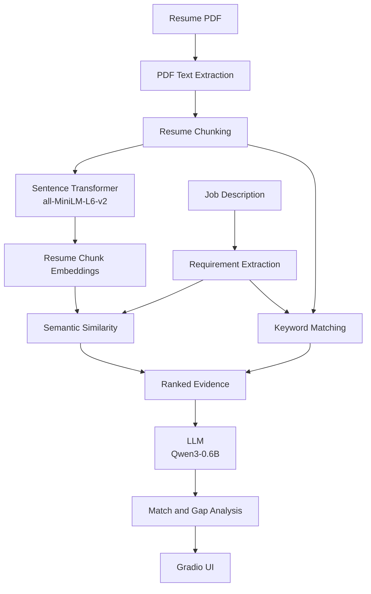

# Resume–JD Analyzer

An AI-powered Resume–Job Description Analyzer that compares a resume against a job description, retrieves relevant resume evidence for each requirement, and uses an LLM to generate concise explanations of matches and gaps.

## Overview

Applying for jobs often means manually comparing a resume with long job descriptions.

This project automates that process.

The application:

- Accepts a resume in PDF format.
- Accepts a job description.
- Extracts the resume text.
- Splits the resume into searchable chunks.
- Converts resume chunks into semantic embeddings.
- Retrieves the most relevant resume evidence for each job requirement.
- Uses an LLM to explain the match and identify genuine gaps.
- Displays the analysis through a simple Gradio interface.

## Architecture




## Key Features

- PDF resume text extraction
- Job description requirement extraction
- Semantic search using sentence embeddings
- Keyword + semantic hybrid retrieval
- Evidence-based LLM explanations
- Match and gap analysis
- Simple Gradio web interface
- Designed to avoid unsupported claims by providing retrieved resume evidence to the LLM

## Project Structure
```text
ai-career-copilot/
├── app/
│   ├── job_analyzer.py
│   ├── llm.py
│   ├── pdf_reader.py
│   └── resume_search.py
├── tests/
│   ├── test_explain.py
│   ├── test_job_analyzer.py
│   ├── test_llm.py
│   ├── test_pdf_reader.py
│   └── test_resume_search.py
├── .gitignore
├── README.md
├── requirements.txt
└── ui.py
```

## How It Works

### 1. Resume extraction

The uploaded PDF is processed using PyMuPDF.

The extracted text is cleaned while preserving the important content of the resume.

### 2. Resume chunking

The resume is divided into smaller pieces so that individual pieces of evidence can be retrieved independently.

For example:

> "Built a Linear Regression model using Python and Scikit-learn..."

can become a searchable chunk.

### 3. Embeddings

Each resume chunk is converted into a numerical vector using:

`sentence-transformers/all-MiniLM-L6-v2`

The model represents the meaning of text as a 384-dimensional vector.

This allows the application to find text that is semantically related even when the exact words are different.

### 4. Hybrid retrieval

For every job requirement, the application calculates:

- semantic similarity
- keyword overlap

These scores are combined to rank resume chunks.

Conceptually:


Final Score =
    0.60 × Semantic Score
  + 0.40 × Keyword Score


The highest-scoring chunks are selected as evidence.

### 5. Evidence-based LLM analysis

The retrieved resume evidence is provided to the LLM together with the job requirement.

The LLM is instructed to:

- explain why the resume matches the requirement
- identify genuine weaknesses
- avoid inventing experience or skills
- use only the supplied resume evidence

Example output:

```
Requirement:
Strong Python programming skills

Analysis:

Match:
The resume demonstrates Python experience through
Python OOPS, Scikit-learn, and machine learning projects.

Gap:
No clear gap.
```

If no relevant evidence is retrieved, the application directly reports:

```
No relevant evidence was found in the resume.
```

This prevents the LLM from inventing evidence when the retrieval system finds nothing relevant.

## RAG Approach

The project follows a basic Retrieval-Augmented Generation (RAG) architecture:

```
Resume
  ↓
Chunks
  ↓
Embeddings
  ↓
Retrieval
  ↓
Relevant Resume Evidence
  ↓
LLM
  ↓
Generated Explanation
```

The LLM does not need to contain the user's resume in its training data. Instead, relevant information is retrieved from the resume at runtime and provided as context.

## Running the Project

### 1. Clone the repository

```bash
git clone <url>
cd ai-career-copilot
```

### 2. Create a virtual environment

```bash
python -m venv <env_name>
```

Activate it on Windows:

```powershell
.\<env_name>\Scripts\Activate.ps1
```

### 3. Install dependencies

```bash
pip install -r requirements.txt
```

### 4. Configure Hugging Face authentication

Create a Hugging Face access token and authenticate using the Hugging Face CLI.

Do not place the token directly inside the source code.

### 5. Start the application

```bash
python app.py
```

Gradio will provide a local URL that can be opened in a browser.

## Example Workflow

1. Upload: `resume.pdf`
2. Paste: `Machine Learning Engineer` job description
3. Extract job requirements
4. Retrieve relevant resume evidence
5. Analyze each requirement
6. Display the result

`
Upload: resume.pdf and 

Paste:  Machine Learning Engineer job description

        ↓

Extract job requirements

        ↓

Retrieve relevant resume evidence

        ↓

Analyze each requirement

        ↓

Display:

   Requirement
     ↓
   Match
     ↓
    Gap


## Design Decisions

### Why embeddings?

Keyword matching alone can miss semantically similar statements.

For example:

- Job description: "Experience developing predictive models"
- Resume: "Built a Linear Regression model using Scikit-learn"

The wording is different, but the concepts are related.

Semantic embeddings help retrieve this type of evidence.

### Why combine semantic and keyword search?

Semantic similarity captures meaning, while keyword overlap helps preserve exact technical terms such as:

- Python
- SQL
- TensorFlow
- Scikit-learn
- XGBoost

Combining both improves retrieval for resume/job matching.

### Why does the LLM receive retrieved evidence?

The LLM is used primarily for explaining retrieved evidence, rather than deciding what exists in the resume.

This keeps the retrieval system as the source of evidence and reduces unsupported claims.

## Technologies Used

### Programming Language

- Python

### Machine Learning & NLP

- Sentence Transformers — generates semantic embeddings for resume chunks
- scikit-learn — cosine similarity and retrieval scoring

### LLM

- Qwen3-0.6B — generates evidence-based match and gap explanations
- Hugging Face Inference — hosted LLM inference

### Document Processing

- PyMuPDF (fitz) — extracts text from PDF resumes

### Web Interface

- Gradio — provides the resume upload, job-description input, and analysis interface

### Core Concepts

- Embeddings
- Semantic Search
- Hybrid Retrieval
- Retrieval-Augmented Generation (RAG)
- Prompt Engineering
- LLM Inference

## Resume File Limitations

The current application has the following limitations:

- Supported format: PDF only.
- File size: No explicit file-size limit is currently enforced. Very large files may take longer to process and require more memory.
- Text-based PDFs: Best supported. The resume should contain selectable text.
- Scanned PDFs: OCR is not currently implemented, so scanned/image-only resumes may not be extracted correctly.
- Complex formatting: Multi-column layouts, tables, text boxes, graphics, and unusual formatting may affect the extracted text order.
- Images: Text contained inside images is not extracted.
- Password-protected PDFs: May not be readable if the document cannot be opened for text extraction.
- Long resumes: Supported, but larger documents produce more chunks and may increase embedding and retrieval time.
- Handwritten content: Not supported.

### Limitations

- Resume PDFs with complex layouts may not extract perfectly.
- The requirement extraction currently uses rule-based text splitting.
- Retrieval quality depends on the quality of resume chunks and embeddings.
- The small hosted LLM may occasionally produce imperfect wording.
- The system does not guarantee that a retrieved match represents the candidate's actual proficiency.
- It is an analysis aid, not a replacement for human review.

## Future Improvements

Possible improvements include:

- Better resume section-aware chunking
- More robust job requirement extraction
- Improved retrieval evaluation
- Persistent vector indexing for larger document collections
- Better UI presentation of match scores
- Support for multiple resumes and job descriptions

## What I Learned

This project helped me understand and apply:

- Natural Language Processing
- Text embeddings
- Semantic similarity
- Information retrieval
- Retrieval-Augmented Generation (RAG)
- LLM inference
- Prompt design
- PDF processing
- Python modularization
- Gradio application development
- Debugging and integrating multiple ML components

## Author

Udaya

Built as a hands-on AI/ML project to explore practical NLP, retrieval, RAG, and LLM application development.
